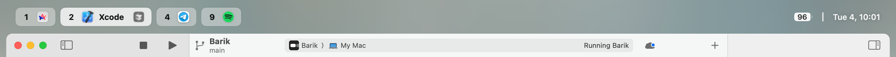
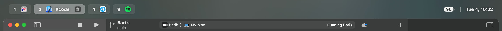
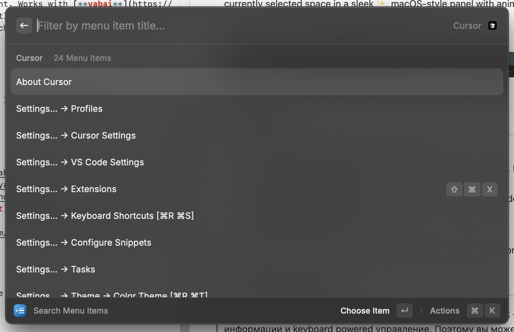

  
  

  
  
  

**barik** is a lightweight macOS menu bar replacement. Powered by [**yabai**](https://github.com/koekeishiya/yabai) and displays the currently selected space in a sleek, macOS-style panel with animations. Now you know which number to press to switch to the desired space!

 

  <h3>Screenshots</h3>
  
  

 

  <h3>Video</h3>
  <video src="https://github.com/user-attachments/assets/33cfd2c2-e961-4d04-8012-664db0113d4f" autoplay loop muted playsinline>

 

## Requirements

- macOS 14.6+
- yabai

## Quick Start

1. Install [yabai](https://github.com/koekeishiya/yabai), set up spaces and paddings ([example](https://github.com/mocki-toki/barik/blob/main/example/.yabairc))
2. Install [skhd](https://github.com/koekeishiya/skhd) for switching spaces (or use another hotkey manager— for example, I like to use [Raycast](https://www.raycast.com/) scripts)
3. Download barik from [Releases](https://github.com/mocki-toki/barik/releases), unzip and move it to your Applications folder
4. Hide the system menu bar in System Settings
5. Run barik from the Applications folder
6. Add barik to your login items

**That's it!** Try switching spaces and see the panel in action.

## Contributing

Contributions are welcome! Please feel free to submit a PR.

## Why Aren't the Space Indicators Clickable?

PR [#7](https://github.com/mocki-toki/barik/issues/7)

The space indicators are not clickable because barik is designed to be keyboard-driven. Use keyboard shortcuts to switch spaces, for example with [skhd](https://github.com/koekeishiya/skhd) or [Raycast](https://www.raycast.com/) scripts.

## Where Are the Menu Items?

PR [#5](https://github.com/mocki-toki/barik/issues/5), [#1](https://github.com/mocki-toki/barik/issues/1)

Menu items are not supported. The original philosophy of barik is to minimize unnecessary information and emphasize keyboard-driven control. However, you can use [Raycast](https://www.raycast.com/), which supports menu items through an interface similar to Spotlight. I personally use it with the `option + tab` shortcut, and it works very well.

If you’re accustomed to using menu items from the system menu bar, simply move your mouse to the top of the screen to reveal the system menu bar, where they will be available.

## License

[MIT](LICENSE)
